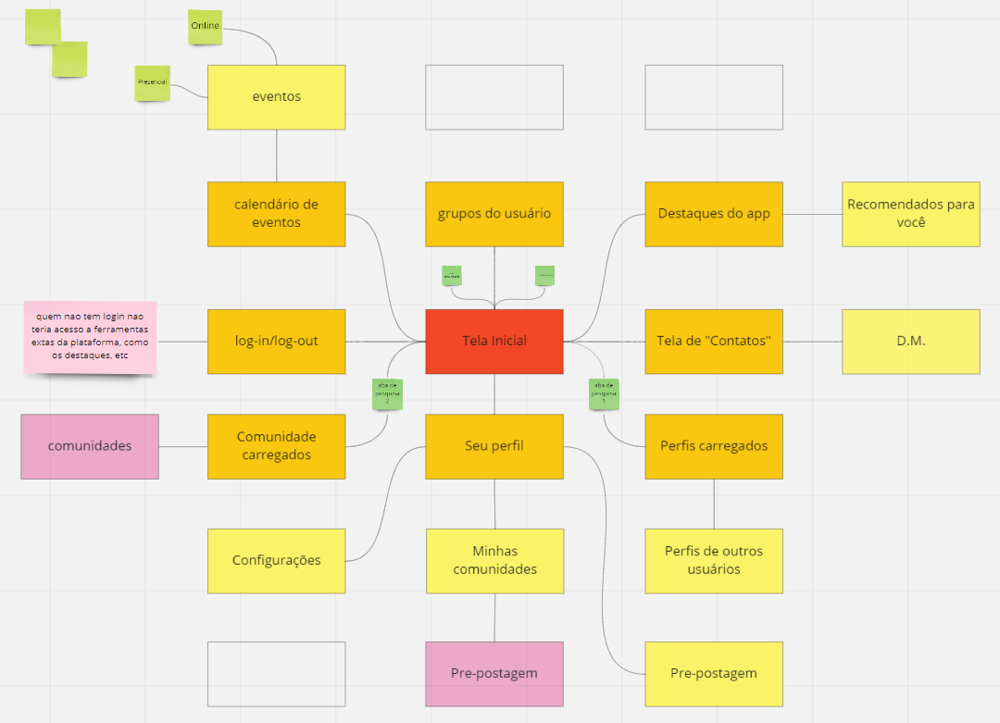
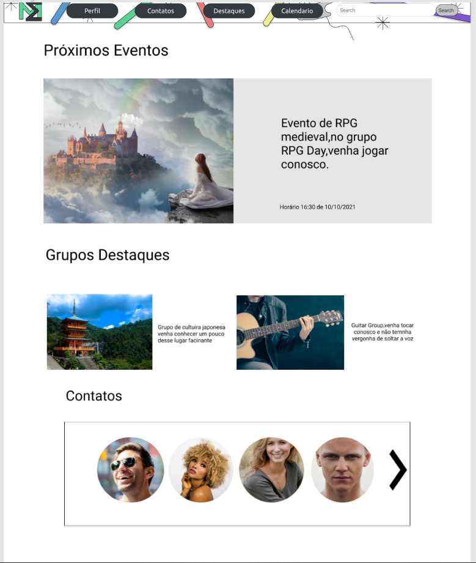
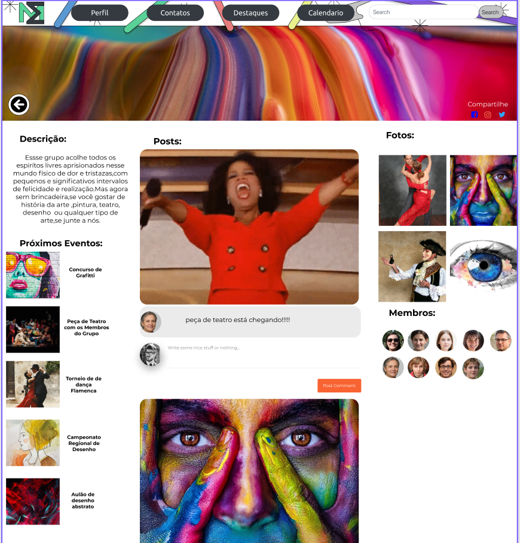
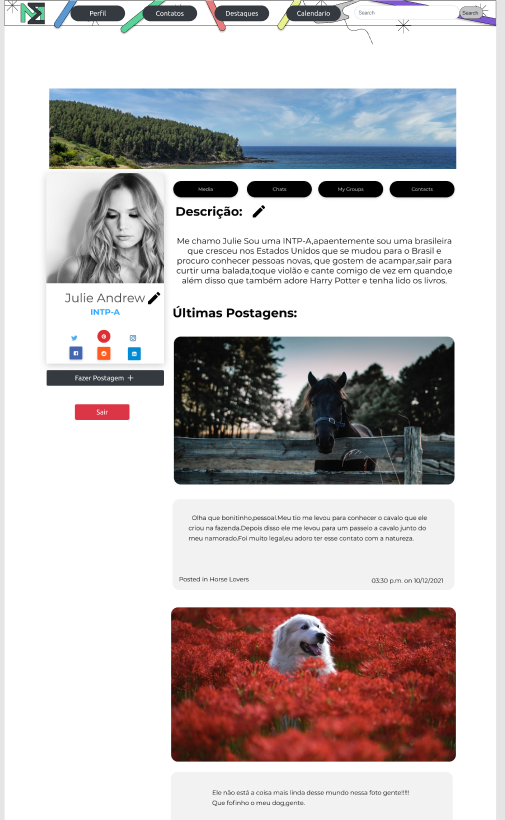

# Projeto de Interface

link da interface interativa no figma <a href="2-Especificação.md">https://www.figma.com/file/EN6tA5hbqYgQ4lREIpQtdP/Untitled?node-id=18%3A4813</a>

## User Flow

 Fluxo de usuário (User Flow) é uma técnica que nos permite desenvolver e mapear todo fluxo de telas do site. Essa técnica funciona para alinhar os caminhos e as possíveis ações que o usuário pode fazer junto com os membros de sua equipe.

## Wireframes principais:

link do wireframe feito no figma:
!https://www.figma.com/file/EN6tA5hbqYgQ4lREIpQtdP/Untitled?node-id=18%3A4813

### Tela - Home-Page
A tela de home-page mostra os eventos principais do site, da acesso ao contatos e aos grupos do usuário. É a partir daqui que as interações do usuário começam, Utilizando a barra de navegação que se localiza acima do conteudo principal da tela leva a 5 elementos distintos:
- Componente de pesquisa que leva aos resultados de pesquisa do grupo;
- Componente de Perfil do Usuário;
- Componente de Acesso ao home;
- Componentes de destaques;
- Componente de contatos. 

### Tela - Grupo
A tela de Grupo apresenta diversas informações sobre o mesmo, Como titulo, breve descrição, membros e posts mais recentes. A partir dela temos a maior parte das  interações entre os usuários.

### Tela - perfil
Na tela de Perfil do usuário se encontra todas as informações publicas do mesmo, ou seja, nome, informações de contato(outras redes sociais, telefone, etc.), seus amigos, grupos e posts. 

