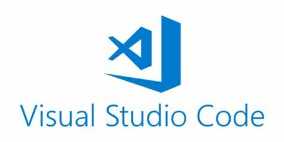

# Gerenciamento de Projeto

> Descreva aqui a metodologia de trabalho do grupo para atacar o
> problema.
## Divisão de Papéis

- **Marcus Prado Silva**: Mestre SCRUM e desenvolvedor,deve orgarniza a equipe,horários,reuniões,as tarefas,fazer backlogs dos Sprints e auxilia todos os da equipe que possuirem dúvidas ou dificuldades durante o projeto seja na parte visual,organização de backlogs do produto ou na parte de avaliação de funcionalidades a serem implementadas.
- **Felipe Augusto Morais Silva**: Analista de UI/UX e desenvolvedor,deve recolher os pedidos dos usertests e propor  tecnologias e ferramentas que possibilitem criar o que os usuários desejaam,atualização de wireframe e layouts quando necessário,criação da identidade visual da aplicação utilizando editores de imagem,e realizar testes de responsividade da aplicação;
- **Felipe Augusto Maciel Constantino**: Analista de Implementação e desenvolvedor,deve apresentar e organizar as ideias geradas nos "brainstorms" compara-las,avaliar os pontos positivos e negativos de implementa-las.Além de mostrar limitações técnicas e práticas de uma funcionalidade utilizando o um de filtaragem de uma semana para todas as funcionalidades da aplicação.
- <s>**Gabriel Da Silva Martins**: Dono do Produto e desenvolvedor,deve propor uma lista de testes e funcionalidades a serem feitas durante o projeto,deve também organizar usertests, recolher o feeback dos usuários,estruturar user visions/storys e fazer os backlogs do produto </s> 

## Processo

Todos da equipe devem verificar diariamente os afazeres da equipe até a entrega do próximo Sprint no Trello,
quando for desenvolver cada integrante entrará no Redbooth,e vai conferir as tarefas que ele terá que concluir até 
a próxima reunião da equipe que ocorre no Microsoft Teams,além disso também encontrará de conter as ideias que cada um teve para a aplicação e os protocolos e regras de desenvolvimento adotadas pela equipe durante o projeto.Todas tarefas de diagramação e organização de ideias são feitas nos dias das reuniões.Na sexta-feira de toda semana todos os integrantes da equipe devem postar um relatório no canal do Discord contendo as atualizações semanais em suas funções dentro do SCRUM.O Mestre SCRUM vai recolher todos os pedidos da equipe e vai criar o backlog do Sprint.

O Dono do Produto vai coletar dados sobre os usuários e apontar uma direção para como deve ser apresentado o produto aos clientes. Depois ele passará todos esses dados e pedidos para o Analista de UI/UX, que vai pesquisar e traçar abordagens para introduzir esses pedidos dentro da ideia de produto original definindo as tecnologias e ferramentas a serem utilizadas.Logo após ele passará as suas ideias para o Analista de Implementação que vai pesquisar e apontar pontos positivos e negativos de cada uma delas(lembrando que este analista avaliará todas as ideias do integrantes, não somente do Analista de UI/UX) e cobrar um cronograma de implementação que deve durar no máximo uma semana,se a ideia não conseguir ser implementada até esse período ele será descartada da lista de tarefas até o próximo reunião da equipe, onde o integrante a qual à proposta foi apresentada poderá reapresenta-la com novos argumentos e o restante da equipe votará a atenção a esta se valer a pena investir nessa novamente.

Depois desse processo,o Mestre SCRUM vai recolher todos essas informações apresentar um resumo das entregas de cada membro da equipe 
durante as reuniões, ele atualizará os quadros de tarefas,irá auxiliar nas tarefas que não alcançaram o rendimento proposto pelo cronograma e vai dividir as tarefas dos próximos Sprints em módulos de obrigações de cada membro na próxima fase,tanto em suas tarefas dentro da metodologia SCRUM quanto suas tarefas como desenvolvedores.

Lembrando que qualquer um da equipe deve propor ideias, conferir o quadro Kanban no Github, solicitar ajuda quando necessário e manter o status e suas tarefas atualizados no Redbooth e no Trello.

## Atribuições

### **Felipe Augusto Maciel Constantino**:

#### Sprint 1:
-   Fluxo de usuário(1/3)
-   Wireframes(1/3)
-   Documentação-Personas
-   Documentação-Requisitos
-   Documentação-Restrições
-   Artefatos de Design Thinking(1/3)
-   Revisões ortográficas (3 sessões)

#### Sprint 2:
-   Funcionalidade de Login do sistema
-   Revisões ortográficas (4 sessões)
-   Plano e execução de Testes de funcionalidades

#### Sprint 3: 
-   Sistema de informar clima consumindo Api
-   Revisões ortográficas (3 sessões)
-   Plano e execução de Testes de funcionalidades

#### Sprint 4:
-   Funcionalidade de calendário
-   Página de perfil do usuário(1/3)
-   Navegação entre as páginas
-   Integração de funcionalidade(1/3)
-   Revisão de código (6 sessões) 
-   Revisões ortográficas (4 sessões)
-   Plano e execução de Testes de funcionalidades(1/3)

### **Felipe Augusto Morais Silva**:

#### Sprint 1:
-   Fluxo de usuário(2/3)
-   Wireframes(2/3)
-   Artefatos de Design Thinking(2/3)
-   Revisões ortográficas (2 sessões)

#### Sprint 2:
-   Templates das telas
-   Revisões ortográficas (5 sessões)
-   Plano e execução de Testes de funcionalidades

#### Sprint 3:
-   Funcionalidade de cadastro de eventos
-   Revisões ortográficas (4 sessões)
-   Plano e execução de Testes de funcionalidades

#### Sprint 4: 
-   Documentação-Público alvo
-   Identidade Visual
-   Home page
-   Página de perfil do usuário(2/3)
-   Página de grupos
-   Página de Login
-   Integração de funcionalidade(2/3)
-   Revisão de código (4 sessões) 
-   Revisões ortográficas (5 sessões)
-   Plano e execução de Testes de funcionalidades(2/3)

### **Marcus Prado Silva**:

#### Sprint 1: 
-   Documentação-Gerenciamento do Projeto
-   Documentação-
-   Fluxo de usuário(3/3)
-   Wireframes(3/3)
-   Artefatos de Design Thinking(3/3)
-   Revisões ortográficas (2 sessões)

#### Sprint 2: 
-   Sistema de cadastro de Pessoas
-   Revisões ortográficas (2 sessões)
-   Plano e execução de Testes de funcionalidades

#### Sprint 3:
-   Sistema de mapas consumindo Api
-   Revisões ortográficas (2 sessões)
-   Plano e execução de Testes de funcionalidades

#### Sprint 4: 
-  Documentação-Problema
-  Documentação-Processos
-  Documentação-Atribuições
-  Documentação-Ferramentas
-  Apresentação de informações de usuários
-  Caixas de postagem e Comentário
-  Apresentação de informação de usuários aleatórios via Api
-  Funcinalidade de Chat
-  Página de perfil do usuário(2/3)
-  Integração de funcionalidade(3/3)
-  Revisão de código (3 sessões) 
-  Plano e execução de Testes de funcionalidades(3/3)

## Ferramentas

As ferramentas empregadas no projeto são:

- Editor de código.
- Ferramentas de comunicação
- Ferramentas de diagramação
- IDE no Browser

O Visual Studio Code foi escolhido porque ele possui uma integração com o
sistema de versão e uma grande gama de estensões que auxiliam no desenvolvimento. As ferramentas de comunicação, Discord e o Microsoft Teams,foram utilizadas pois possuem
integração semelhante,canais de compartilhamento e filmagem de reuniões.Depois, para criar
diagramas utilizamos o Miro por ter afinidade com a interface e essa ferramenta captar as
necessidades da nossa solução.Utilizamos o Trello para o gerenciamento de funções de cada integrante do projeto,e usamos
o Redbooth para gerenciamneto de funcionalidas,além de filtragem e priorização de ideias a serem implementadas.Por fim,utilizamos 
o recurso de criar equipes no Replit,possibilitando a edição de código de um arquivo simultâneamente por todos os membros do grupo
além de também permitir ter  cópias dos arquivos salvos na nuvem.
Construção dos wireframes do projeto pela a plataforma Figma e desenvolvimento compartilhado do código da nossa aplicação pelo Git e GitHub.  

> **Possíveis Ferramentas que auxiliarão no gerenciamento**: 
> - 
> - 
> 
> - 
> - 
> - 
> - 
> - 
> 
